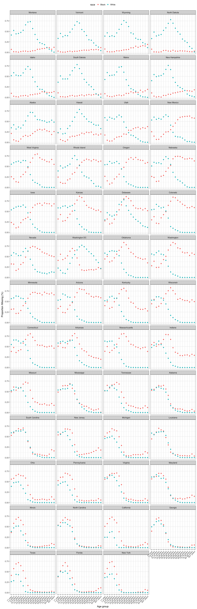
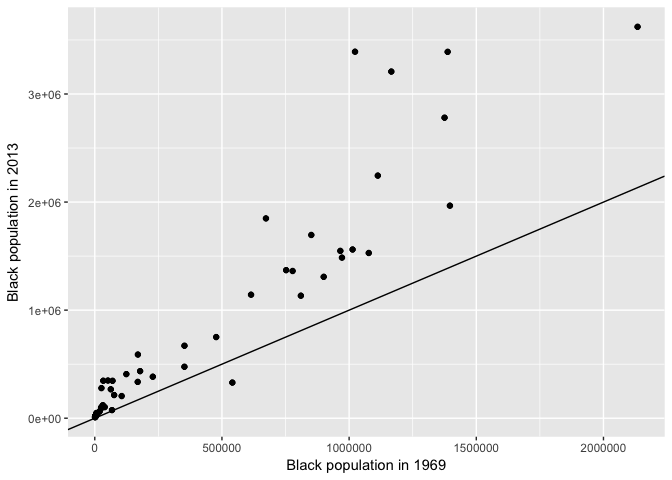
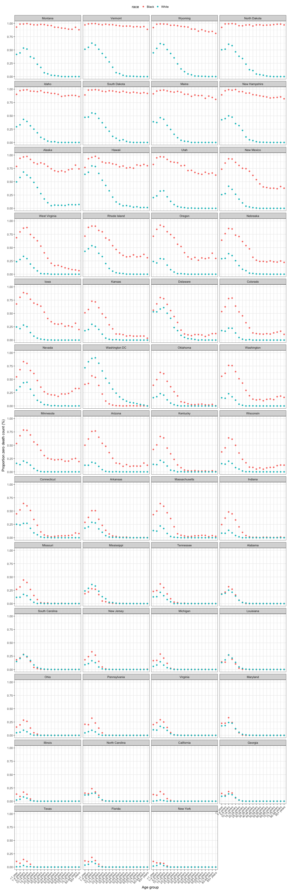
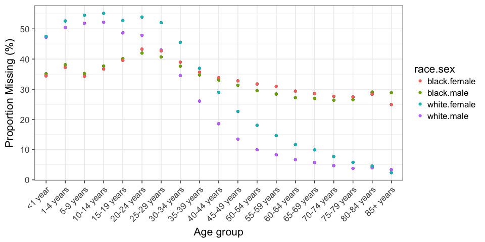
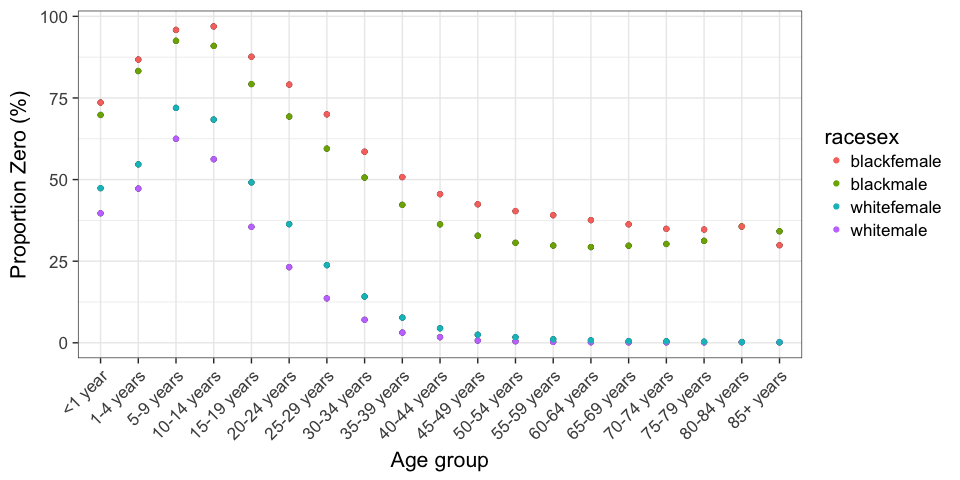
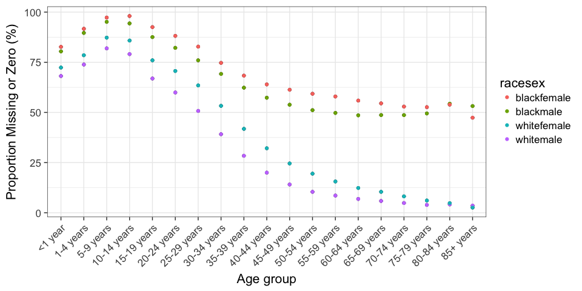

3\_Explore\_Missingness
================
Corinne Riddell
1/19/2017

``` r
library(tidyverse)
```

    ## Loading tidyverse: ggplot2
    ## Loading tidyverse: tibble
    ## Loading tidyverse: tidyr
    ## Loading tidyverse: readr
    ## Loading tidyverse: purrr
    ## Loading tidyverse: dplyr

    ## Conflicts with tidy packages ----------------------------------------------

    ## filter(): dplyr, stats
    ## lag():    dplyr, stats

``` r
library(forcats)
dat.clean<- read.csv("/Users/corinneriddell/Dropbox/BlackWhiteGap/Data/dat_clean.csv", header = T)
```

### Initial graphs on missing data

Notes on Figure 1 (below):

-   Figure 1 is sorted by size of the black population in the state in 2013. This is so you can see how missingness is a function of population size. We expect that states with less black people will have more missing data and more counts of exactly zero. Thus, states with the biggest populations (of blacks and whites) will "hold constant" the effect of population size on the amount of missing data.

-   The first panels you see in Figure 1 (below) are for the states with the smallest black populations. For whites, the amount of missing data increases in age until about 40 years old, and then decreases. For blacks, the amount of missing data is very low across age. This seemed strange to me at first, but then I remembered that the data is not missing if the count is equal to 0, which will be the case for many strata in these states with the lowest black population.

-   As you read left to right (as the black population size increases by state), the trends in missing data across age look more similar by race, although blacks appear to have more missing data in individuals &lt; 30 years old for the states with the most black people.

**Figure 1: Proportion missing by State (panel) and Age group (x-axis), ordered by increasing size of black population in 2013** 

**Examine the growth of the black population between 1969 and 2013**

``` r
ggplot(subset(bystate, age == "<1 year"), aes(pop_by_race_1969, pop_by_race_2013)) + 
  geom_point() + 
  geom_abline(intercept = 0, slope = 1) + 
  xlab("Black population in 1969") + 
  ylab("Black population in 2013")
```



``` r
unique(bystate$state[bystate$age == "<1 year" & bystate$pop_by_race_1969 < 10000])
```

    ##  [1] Alaska        Hawaii        Idaho         Maine         Montana      
    ##  [6] New Hampshire North Dakota  South Dakota  Utah          Vermont      
    ## [11] Wyoming      
    ## 51 Levels: Alabama Alaska Arizona Arkansas California ... Wyoming

Notes on Figure 2 (below):

-   Figure 2 examines the proportion of counts equal to zero. The purpose of this examination is to visually confirm that there are higher proportions of zero counts in the states with the least amount of blacks. This is very clear when viewing the figure.

-   Question - any explantion for why the portion of zeroes stays relatively higher in blacks vs. whites in the states with the most blacks (within the younger age groups)?

**Figure 2: Proportion zero by State (panel) and Age group (x-axis), ordered by increasing size of black population in 2013**



### Other plots (less interesting/informative)

**How is missingness related to age, race, and sex?**



**Let's look at the proportion with 0's**



**Missing or zero (which is equivalent to &lt; 10)**


