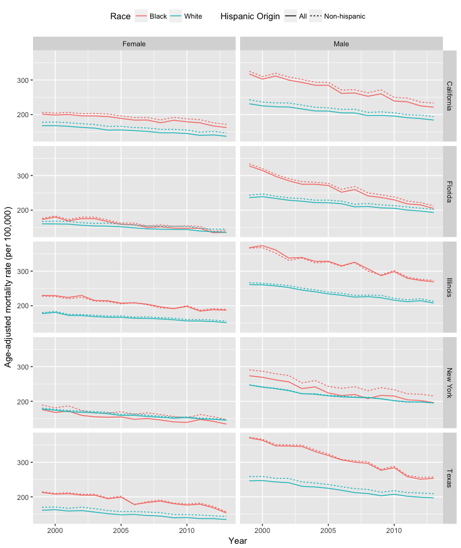
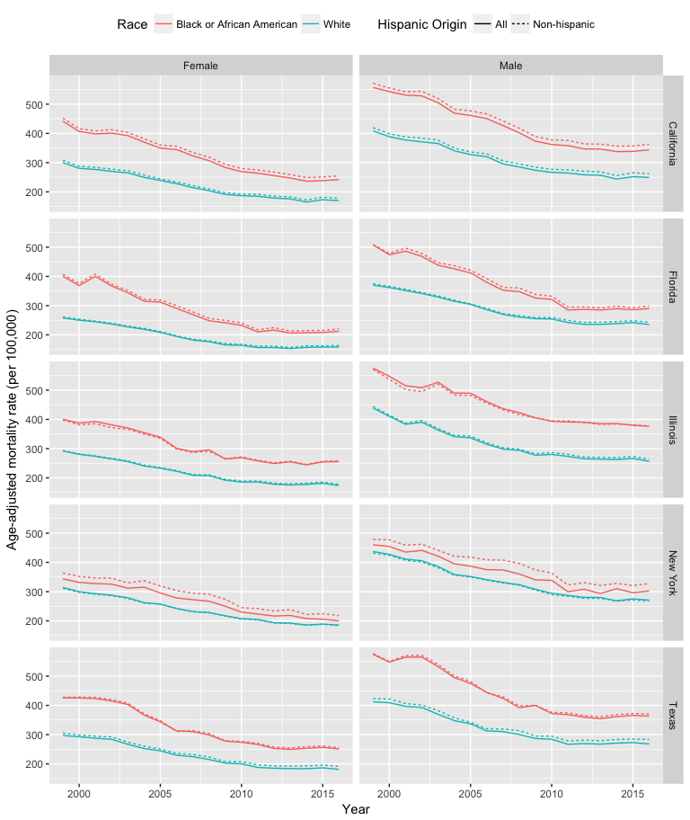
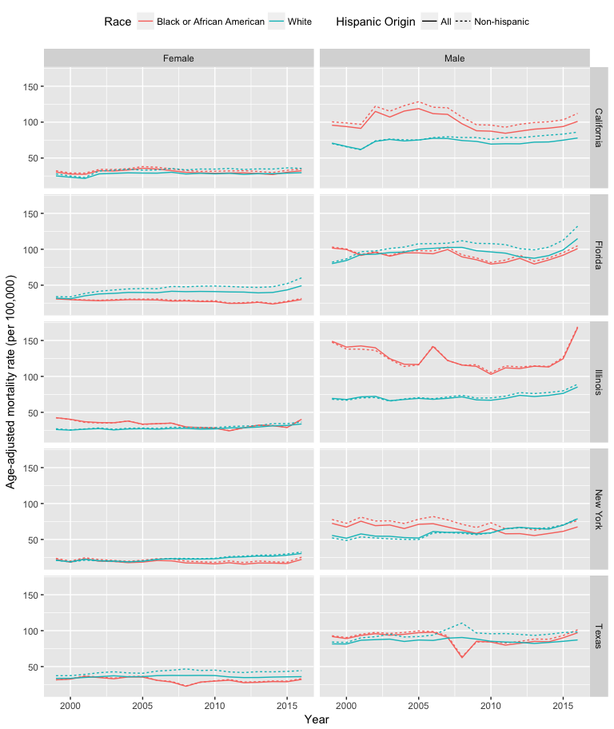

Supplementary Appendix 3: Trends in black and white mortality rates before and after excluding Hispanics, 1999-2013
================

This is the third supplementary appendix for the paper, "Trends in the contribution of major causes of death to the black-white life expectancy gap by US state. A retrospective study of all deaths between 1969 and 2013."

Corinne A Riddell, PhD; Kathryn T Morrison, PhD; Jay S Kaufman, PhD; Sam Harper, PhD

Address correspondence to: Corinne Riddell, PhD, Department of Epidemiology, Biostatistics & Occupational Health, McGill University, 1020 Pine Avenue West, Room 36B, Montreal, QC H3A 1A2, Canada. Email: <corinne.riddell@mail.mcgill.ca>

In our main analyses, we included Hispanics as part of the black and white racial groups. To investigate the impact of including Hispanics on mortality, we inspected mortality trends for five key states with large Hispanic immigrant populations (California, New York, Florida, Texas, and Illinois). We extracted this mortality data using (CDC WONDER's)\[<https://wonder.cdc.gov/>\] compressed mortality file. Hispanic ethnicity is only available beginning in 1999, so we consider the time period from 1999 to 2013. We extract age-adjusted mortality rates related to the circulatory system ("CVD", ICD-10 codes I00-I99), neoplasms ("cancers", ICD-10 codes C00-D48) and external causes ("injuries", ICD-10 codes V01-Y89) by year, state, race, and gender, for (a) non-Hispanics and (b) regardless of Hispanic ethinicity.

**Trends in cancer mortality for all whites and blacks vs. non-Hispanic whites and blacks, 1999-2013**

    ## ── Attaching packages ────────────────────────────────── tidyverse 1.2.1 ──

    ## ✔ ggplot2 2.2.1.9000     ✔ purrr   0.2.4     
    ## ✔ tibble  1.4.2          ✔ dplyr   0.7.4     
    ## ✔ tidyr   0.8.0          ✔ stringr 1.2.0     
    ## ✔ readr   1.1.1          ✔ forcats 0.2.0

    ## Warning: package 'tibble' was built under R version 3.4.3

    ## Warning: package 'tidyr' was built under R version 3.4.3

    ## ── Conflicts ───────────────────────────────────── tidyverse_conflicts() ──
    ## ✖ dplyr::filter() masks stats::filter()
    ## ✖ dplyr::lag()    masks stats::lag()

**Trends in CVD mortality for all whites and blacks vs. non-Hispanic whites and blacks, 1999-2013** 

**Trends in injury mortality for all whites and blacks vs. non-Hispanic whites and blacks, 1999-2013** 
